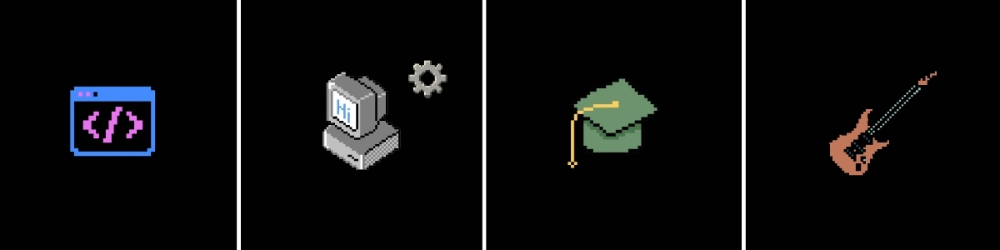

  <!-- Imagem do Kaizen do seu Pinterest -->
  <!-- Imagem do seu upload recortada na proporção de banner -->
  

  # Hi! I'm Anwar Machado.
  `Backend Developer & Guitar Player` 

   

  <!-- Links de Redes Sociais e Plataformas -->
  

    
    
    
    
  

 

### About Me

 

  <!-- Imagem única dos 4 cartões "About Me" -->
  

 

### ⚙️ Tech Stack & System Design

  <!-- Backend & Core -->
  
  
  
   
  <!-- Frontend -->
  
  
  
   
  <!-- DevOps, Data & Observability -->
  
  
  
  
  

  <!-- Concepts & Architecture Badges -->
  
  
  
  

 

### 📈 Statistics

  <!-- Cartão de Estatísticas do GitHub -->
  
  <!-- Cartão de Sequência de Commits (Streak) -->
  

<!-- Gráfico de Atividade/Contribuições Dark -->

  

